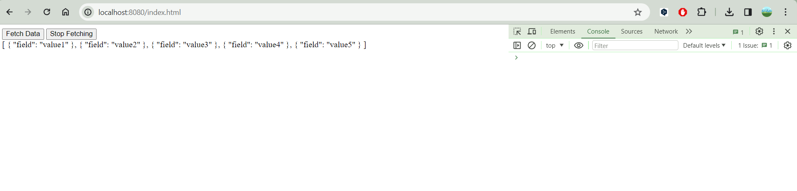
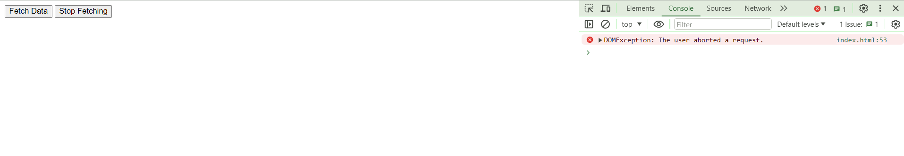

<h1> Как проверять проект </h1>
- В ChunkedJsonController реализован контроллер, отправляющий запрос чанками с интервалом в 5 сек между чанками.
Есть также 2 кнопки в index.html расположенном в src/main/resources/static. При нажатии fetchData через 25с появится json

при нажитии stop fetching соединение разорвется и сервер выведет в лог: Client disconnected.

Обработчики кнопок, валидация json и разрыв соединения реализованы в index.html в script.

- **Логи**
2024-03-09T20:41:23.101+03:00  INFO 2060 --- [           main] com.example.demo.Lab13Application        : Starting Lab13Application using Java 21.0.2 with PID 2060 (C:\Users\astaf\IdeaProjects\JavaTasks\Lab13\target\classes started by astaf in C:\Users\astaf\IdeaProjects\JavaTasks\Lab13) \
2024-03-09T20:41:23.106+03:00  INFO 2060 --- [           main] com.example.demo.Lab13Application        : No active profile set, falling back to 1 default profile: "default" \
2024-03-09T20:41:24.589+03:00  WARN 2060 --- [           main] ion$DefaultTemplateResolverConfiguration : Cannot find template location: classpath:/templates/ (please add some templates, check your Thymeleaf configuration, or set spring.thymeleaf.check-template-location=false) \
2024-03-09T20:41:25.076+03:00  INFO 2060 --- [           main] o.s.b.web.embedded.netty.NettyWebServer  : Netty started on port 8080 \
2024-03-09T20:41:25.084+03:00  INFO 2060 --- [           main] com.example.demo.Lab13Application        : Started Lab13Application in 2.548 seconds (process running for 3.568) \
Client disconnected

